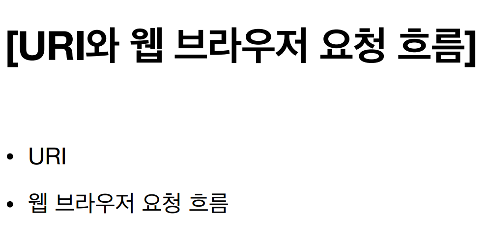

# URI란?

> URI는 **Uniform Resource Identifier** 의 약자다.

  

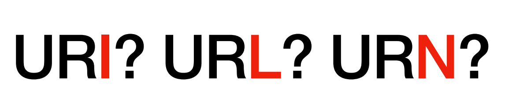

> URI 말고도 URL이나 URN이라는 것이 언급되기도 하는데 그 차이는 무엇일까?

 

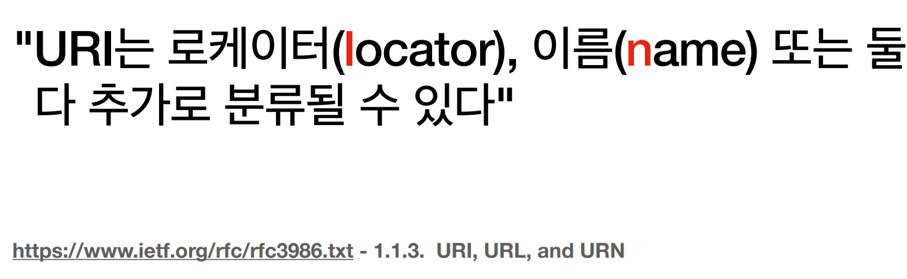

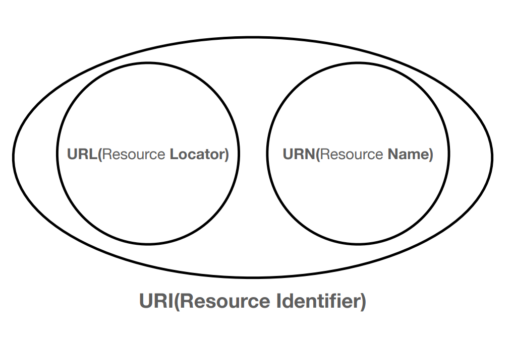

> URI 안에 URL과 URN의 개념이 포함되는 구조다.

  

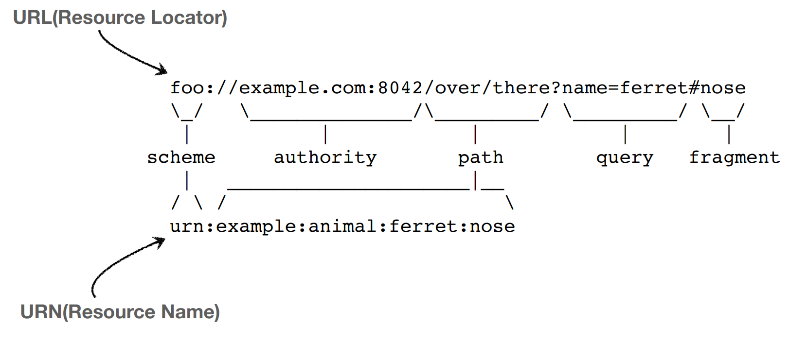

> 우리가 흔히 보는 링크를 URL이라고 한다. 거의 URL만 쓴다.

  

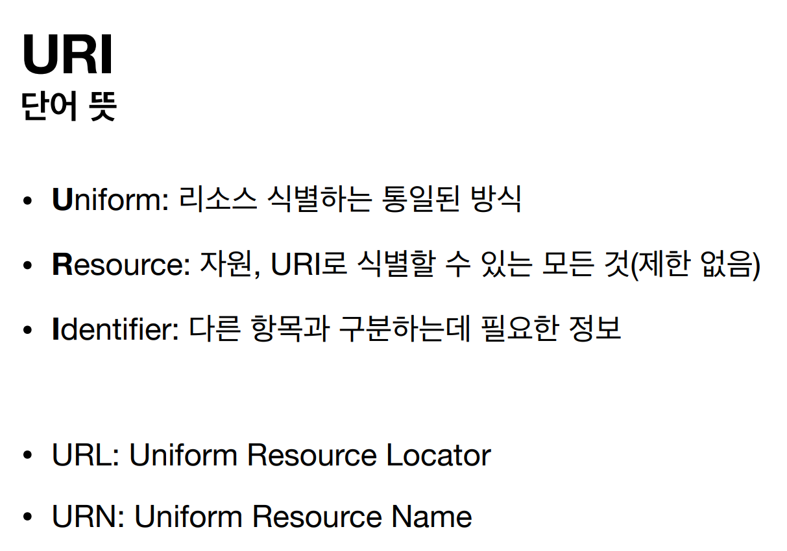

> URL은 리소스가 있는 위치를 의미하고
> URN은 리소스에 이름을 부여한다.
> 위치는 변할 수 있지만, 이름은 변하지 않는다.
> URN 이름만으로 실제 리소스를 찾을 수 있는 방법이 보편화 되지 않았다.

  

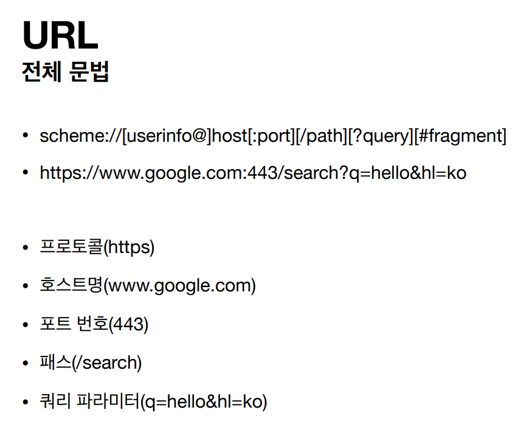

> URL의 각 부분은 위의 형식처럼 불린다.
> protocol, host, port, path, query 등이 있다.

> 위의 scheme 부분에는 보통 프로토콜이 들어간다. 프로토콜에는 http, https, ftp 등이 있다.
> http는 80포트, https는 443 포트를 주로 사용하는데, 이럴 경우 주소에 포트를 생략할 수 있다.
> https는 http에 보안이 추가된 것이다.

> [userinfo@] 라고 나와있는 부분에는 사용자 정보를 포함해서 인증한다. 하지만 거의 사용하지 않는 기능이다.

> 호스트명은 도메인명이나 IP주소를 적는다.

> path는 리소스가 있는 경로를 의미한다. 보통 계층적 구조로 되어있다.
> 예: /home/file1.jpg, /members/100

> query에는 보통 key=value 값이 들어간다.
> ?로 시작하고 &로 여러 개를 추가 할 수 있다. (?keyA=valueA&keyB=valueB)
> query는 query string 혹은 query parameter라고 불린다.
> string이라고 불리는 이유는 이 안의 모든 값이 string 형태로 표현되기 때문이고

> fragment는 html 내부 line에서 이동하는 경우(북마크 같은 기능) 사용한다.

  

# 웹 브라우저 요청 흐름

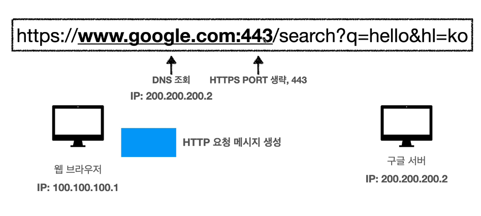

> 주소를 입력하면 먼저 DNS를 조회해서 IP 주소를 얻는다.
> 그리고 PORT 번호도 따온다.
> 그 다음에는 HTTP 요청 메시지를 생성한다.

  

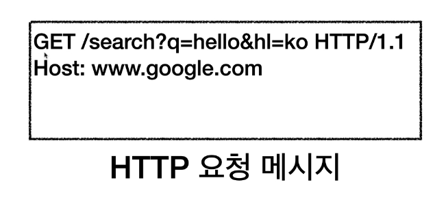

> HTTP 요청 메시지는 위처럼 생겼다. (간략한 버전)
> 1.1은 HTTP의 버전 정보다.

  

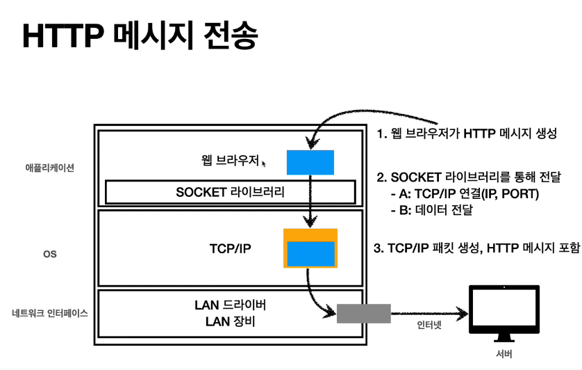

> 애플리케이션 층에서 생성된 HTTP 요청 메시지(파란 박스)는 SOCKET 라이브러리를 통해 TCP/IP 계층으로 전달된다. 3way handshake를 통해 연결한다.
> TCP/IP에서 HTTP 요청 메시지를 패킷으로 감싼다. (IP PORT 정보가 들어있다.)

  

> TCP/IP 패킷이 감싸진 모습

  

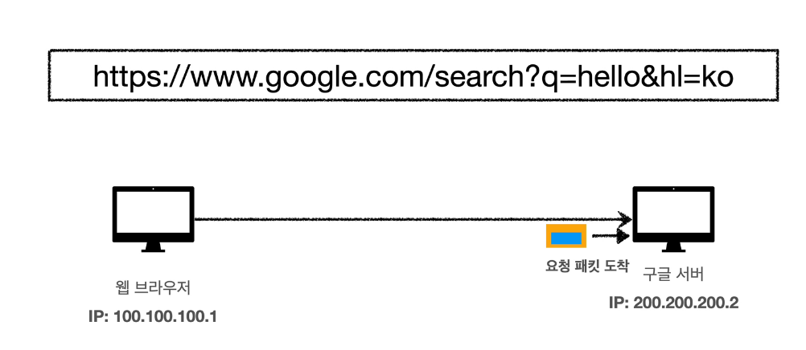

> 요청 패킷이 도착하면 TCP/IP 패킷을 벗겨내고 메시지를 읽는다.

  

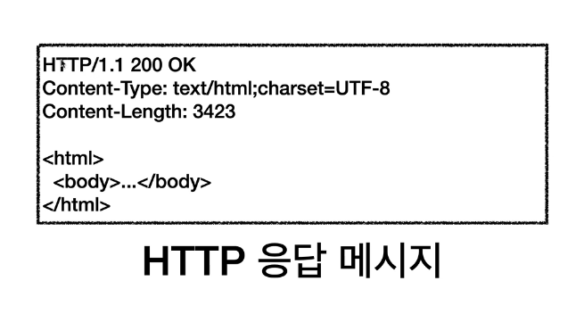

> 메시지를 읽었다면 응답 메시지를 보내야 하는데 형태는 대략 이렇다(자세한 건 추후에 설명된다).
> 응답 메시지 위에 똑같이 TCP/IP 패킷이 씌워지고 브라우저로 보내진다.

  

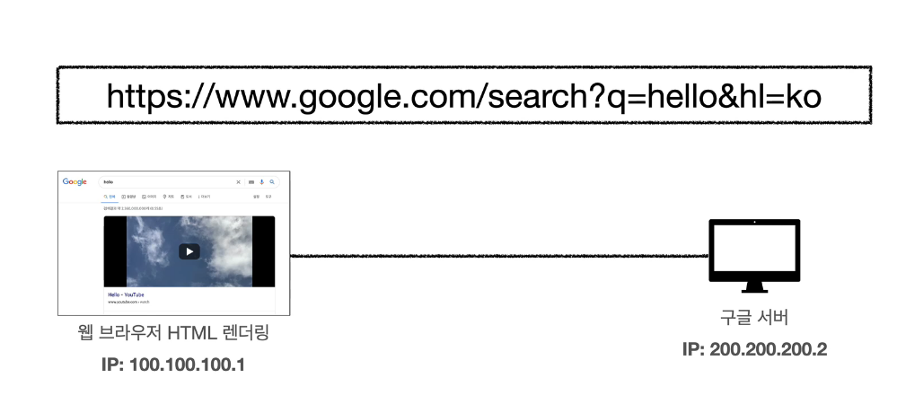

> 응답을 받은 브라우저는 마찬가지로 TCP/IP 패킷을 벗겨내고 HTTP 메시지를 읽고 렌더링을 한다.
