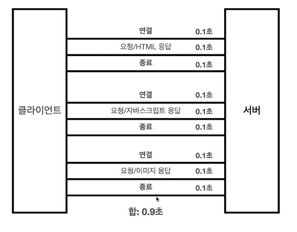
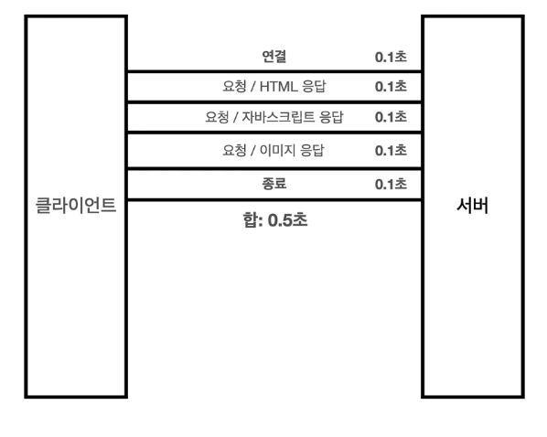
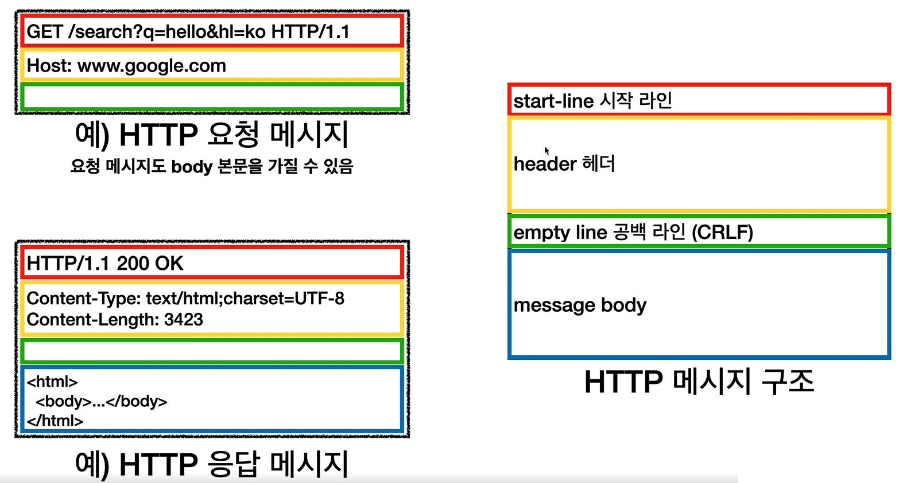
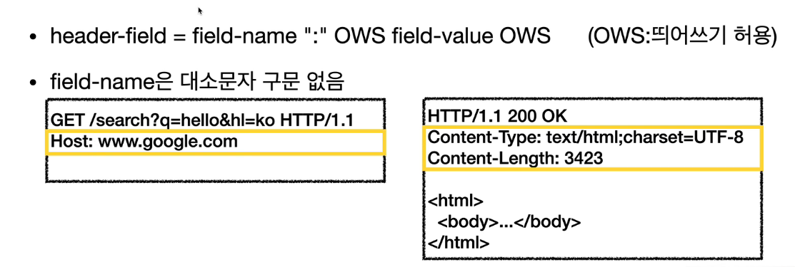

# HTTP 기본

## HTTP(HyperText Transfer Protocol)

> 뭔가 text를 전송하는 것 같지만 지금은 모든 종류의 데이터를 전송한다.

- HTML, Text
- 이미지, 음성, 영상 파일
- JSON, XML

> 서버끼리 데이터를 주고 받을 때도 거의 HTTP를 사용한다.

### HTTP의 역사

> HTTP/0.9: 1991년 버전. GET 메서드만 지원하고 헤더가 없다.
> HTTP/1.0: 1996년 버전. 메서드와 헤더가 추가 됨.
> HTTP/1.1: 1997년 버전. 현재 많이 사용한다. 가장 중요한 버전. (99년,14년에 개선됨)
> HTTP/2: 2015년 버전. 성능 개선 버전
> HTTP/3: ~ing. TCP 대신 UDP 사용

### 클라이언트 서버 구조?

> Request, Response 구조다.
> 클라이언트는 서버에 요청을 보내고 응답을 기다린다.
> 서버가 요청에 대한 결과를 만들어서 응답한다.

> 예전에는 클라이언트와 서버가 구분되지 않았다.
> 지금은 구분이 되어 있다. 데이터나 비즈니스 로직은 서버에 있다.
> 클라이언트는 사용성과 UI를 담당한다.

> 이렇게 되면 클라이언트와 서버가 각자 독립적으로 진화할 수 있다.

### 무상태 프로토콜

> 스테이트리스(Stateless)

> 서버가 클라이언트의 상태를 보존하지 않는다.

#### Stateful, Stateless 차이

> Stateful은 서버가 클라이언트의 이전 상태를 보존하는 것을 말한다.

> Stateless에서는 클라이언트의 이전 상태를 보존하지 않는다. 따라서 고객이 물건을 구매하는데 중간에 점원이 바뀌는 것과 같다. 그러면 고객은 물건 몇 개를 얼마에 어떻게 구매하는지 정확히 말해줘야 한다.

> 무상태로 설계를 하면 이론적으로 무한으로 확장할 수 있다. 갑자기 클라이언트 요청이 증가해도 서버를 대거 투입하면 되기 때문이다.

> 무상태로 설계를 하면 서버 하나에 문제가 생겨도 중계서버에 의해 쉽게 다른 서버로 옮겨서 문제없이 요청을 보낼 수 있다.

> 무상태로 설계를 하면 수평 확장에 유리하다.

> 로그인이 필요 없는 단순한 서비스 소개 화면은 무상태로 설계하기 쉽다.
> 하지만 로그인이 필요한 기능은 로그인 했다는 상태를 서버에서 유지해야 한다.
> 이를 쿠키와 서버 세션등을 사용해서 상태 유지를 한다. 상태 유지는 최소한만 사용해야 한다.
> 무상태의 또 다른 단점을 데이터를 많이 보내야 한다는 것이다.

  

### 비연결성(connectionless)

> 일반적으로 서버와 클라이언트가 응답과 요청을 주고 받을 때 서버는 연결을 계속 유지하고 있다. 서버 자원은 계속 소모된다.

> 응답과 요청을 주고 받고 연결을 끊는 것을 비연결성이라고 한다. 이렇게 되면 최소한의 자원으로 서버를 유지할 수 있게 된다.

> HTTP는 기본적으로 연결을 유지하지 않는 모델이다. 일반적으로 초 단위 이하의 빠른 속도로 응답한다. 즉, 1시간 동안 수천명이 서비스를 사용해도 실제 서버에서 동시에 처리하는 요청은 수십개 이하라는 뜻이다.

> 단점: 연결을 끊어버리기 때문에 TCP/IP 연결을 새로 맺어야 한다. (3 way handshake 시간이 추가된다)
> HTML 뿐만 아니라 js, css 등 많은 자원이 함께 다운로드된다.

> 해결: 지금은 HTTP 지속 연결로 문제를 해결했다. (HTTP 2, 3에서는 더 많이 최적화가 되었다.)

> 일반적인 HTTP

> HTTP 지속 연결 적용

  

### 서버 개발자들이 어려워하는 업무

> 같은 시간에 딱 맞추어 발생하는 대용량 트래픽

> 예: 선착순 이벤트, 티켓 예매 오픈, 수강 신청 등등

> 이럴 때 스테이트리스로 설계하는 것이 중요하다. 실무에서는 정적 html을 하나 뿌려서 요청 시간이 조금이라도 분산되게 한다.

    

### HTTP 메시지

> HTTP 메시지 구조는 위와 같다.
> 맨 위에 start-line (시작 라인)이 있다.
> 그 밑에 header (헤더)가 있다.
> 그리고 공백(CRLF)이 있다.
> 그 다음에 message-body가 있다.

#### start-line (시작 라인)

> 시작 라인은 요청이나 응답에 따라 **request-line / status-line** 이다.
> request-line은 다음과 같이 작성한다:
> method SP(공백) request-target SP HTTP-version CRLF(엔터)
> GET /search?q=hello&hl=ko HTTP/1.1 (예시)
> 보이는 것처럼 request-line에는 HTTP 메서드, 요청 대상, HTTP Version 총 3 종류의 데이터로 구성된다.

> HTTP 메서드는 GET, POST, PUT, DELETE 등을 말하며, 서버가 수행하는 동작을 지정한다.

> 응답 메시지의 시작 라인은 status-line이다.
> 구성은 HTTP-version SP status-code SP reason-phrase CRLF
> HTTP/1.1 200 OK (예시)
> HTTP 버전, 상태 코드, 이유 문구로 구성되어 있다.

#### HTTP 헤더

> 헤더는 위처럼 구성된다.
> HTTP 헤더에는 전송에 필요한 모든 부가 정보가 들어있다.
> 예: 바디 내용, 바디의 크기, 압축, 인증, 요청 클라이언트 정보, 서버 애플리케이션 정보, 캐시 관리 정보 등등..

> 표준 헤더는 매우 많다.

#### 메시지 바디

> 메시지 바디는 실제 전송할 데이터를 갖고 있다.
