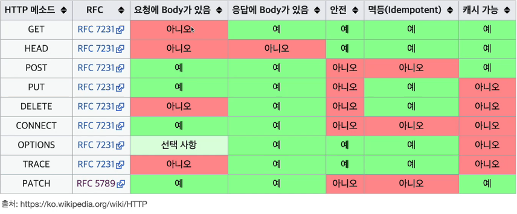

# Http 메서드

> 요구사항 예시

> 회원 정보 관리 API를 만들어라

#### API URI 설계

URI(Uniform Resource Identifier)

회원 목록 조회 / read-member-list
회원 조회 / read-member-by-id
회원 등록 / create-member
회원 수정 / update-member
회원 삭제 / delete-member

#### 어떻게 하면 좋은 URI 설계일까?

가장 중요한 것을 리소스 식별이다.

#### 리소스란?

회원을 등록하고 수정하고 조회하는 게 리소스가 아니다.
회원이라는 개념 자체가 바로 리소스다.

#### 리소스를 어떻게 식별하는 게 좋을까?

회원을 등록하고 수정하고 조회하는 것을 모두 배제

회원 목록 조희 /members
회원 조회 /members/{id}
회원 등록 /members/{id}
회원 수정 /members/{id}
회원 삭제 /members/{id}

#### 조회, 등록, 수정, 삭제를 어떻게 구분할까?

URI는 리소스만 식별한다.
리소스와 행위를 분리한다.
리소스와 해당 리소스를 대상하는 행위를 분리

> 리소스: 회원
> 행위: 조회, 등록, 삭제, 변경

행위를 표현하기 위해 Http 메서드를 사용한다.
(GET, POST, PUT, DELETE)

### HTTP 메서드 종류

> GET: 리소스 조회
> POST: 요청 데이터 처리, 주로 등록에 사용
> PUT: 리소스를 대체, 해당 리소스가 없으면 생성
> PATCH: 리소스 부분 변경
> DELETE: 리소스 삭제

#### 기타

> HEAD: GET과 동일하지만 메시지 부분을 제외하고 상태 줄과 헤더만 반환
> OPTIONS
> CONNECT
> TRACE

#### GET

> 리소스 조회
> 서버에 전달하고 싶은 데이터는 query(쿼리 파라미터, 쿼리 스트링)를 통해서 전달
> 메시지 바디를 사용해서 데이터를 전달할 수 있지만, 지원하지 않는 서버가 많아서 권장하지 않는다.

#### POST

> 요청 데이터 처리
> 메시지 바디를 통해 서버로 요청 데이터 전달
> 서버는 요청 데이터를 처리
> 메시지 바디를 통해 들어온 데이터를 처리하는 모든 기능을 수행한다.
> 주로 전달된 데이터로 신규 리소스 등록, 프로세스 처리에 사용

> POST는 의미가 많다.
> POST는 등록이라는 의미가 아니라 대상 리소스가 리소스의 고유한 의미 체계에 따라 요청에 포함된 표현을 처리하도록 요청한다는 것이다.

> POST 사용하는 경우 정리:

1. 새 리소스 생성(등록)
2. 요청 데이터 처리 (데이터 생성, 변경 뿐만이 아니라 프로세스의 상태가 변경되는 경우)

- 실무에서 URI에 동사를 넣어야 하는 경우가 있다. (예: 배달을 시작하세요) 이런 경우 컨트롤 URI를 사용한다고 말한다.

3. 다른 메서드로 처리하기 애매한 경우

- JSON으로 조회 데이터를 넘겨야 하는데, GET 메서드를 사용하기 어려운 경우

> 조회는 POST로 할 수도 있지만, 되도록 GET을 쓰자. GET은 캐싱이 되지만 POST는 캐싱하기가 어렵다.

#### PUT

> 리소스를 대체한다.

- 리소스가 있으면 완전히 대체한다.
- 리소스가 없으면 생성한다.
- 복붙과 같은 원리다.

> 클라이언트가 리소스 위치를 알고 있다.

- 리소스 위치를 알고 URI를 지정하는 것이 POST와 다르다.

#### PATCH

> 리소스를 부분적으로 변경한다.

#### DELETE

> 리소스를 삭제한다.

  

#### HTTP 메서드의 속성

 

##### 안전

> 호출해도 리소스를 변경하지 않는 경우를 안전하다고 한다.
> 리소스를 바꿀 수 있는 경우 안전하지 않다고 한다.

##### 멱등(Idempotent)

> 호출 횟수에 관계없이 결과가 똑같다.
> GET: 몇 번을 조회해도 결과가 똑같다.
> PUT: 결과를 대체하기 때문에 최종 결과는 같다.
> DELETE: 최종적으로 결과를 삭제하기 때문에 멱등이다.
> POST: 두 번 호출하면 같은 결제가 중복해서 발생할 수 있기 때문에 멱등이 아니다.
> PATCH: PUT과 같은 동작은 멱등이지만 A -> B 이동하세요와 같은 요청은 두 번 요청 시 에러가 발생하기 때문에 멱등이 아니다.
> 멱등 개념이 필요한 이유:
> 서버가 TIMEOUT 등으로 정상 응답을 못주었을 때, 클라이언트가 같은 요청을 다시 해도 되는가?

##### 캐시가능

> 응답 결과 리소스를 캐시해서 사용해도 되는가?

- GET, HEAD, POST, PATCH 캐시가능
- 실제로는 GET, HEAD 정도만 캐시로 사용한다.
- POST, PATCH는 본문 내용까지 캐시 키로 고려해야 하는데, 구현이 쉽지 않다.
