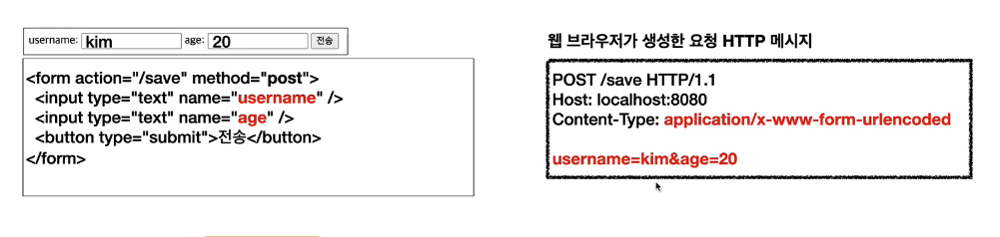
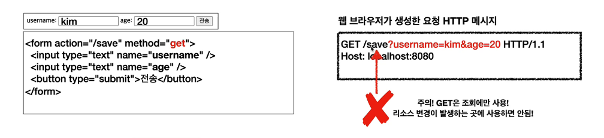
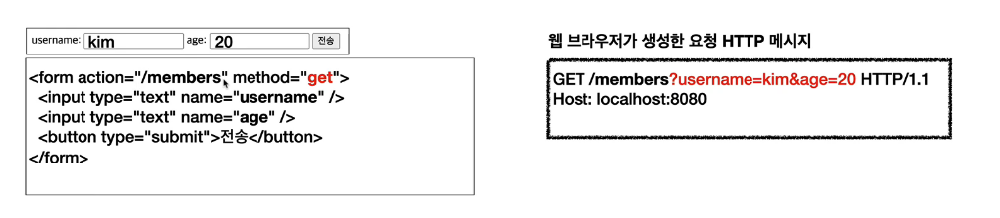
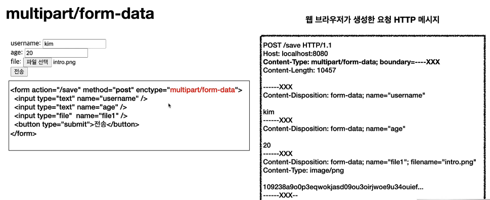
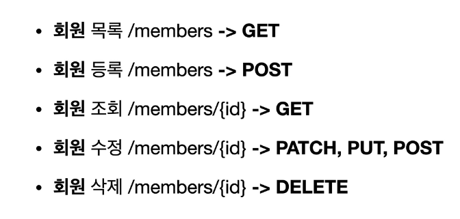
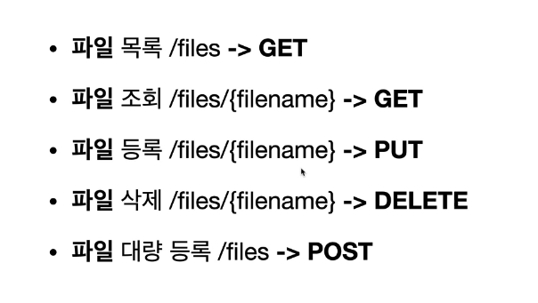

# Http 메서드 활용

### 클라이언트에서 서버로 데이터 전송

#### 데이터 전달 방식은 크게 두 가지가 있다.

1. 쿼리 파라미터를 통한 데이터 전송

- GET
- 주로 정렬 필터

2. 메시지 바디를 통한 데이터 전송

- POST, PUT, PATCH
- 회원 가입, 상품 주문, 리소스 등록, 리소스 변경

 

#### 데이터 전송 상황

1. 정적 데이터 조회

- 이미지, 정적 텍스트 문서
- 정적 데이터를 조회할 때는 쿼리 파라미터 없이 조회할 수 있다.

2. 동적 데이터 조회

- 검색, 정렬 필터
- 검색어나 정렬 필터 기준을 세워줄 때는 쿼리 파라미터를 사용한다.

3. HTML Form을 통한 데이터 전송

- 회원 가입, 상품 주문, 데이터 변경
- form 데이터를 보낼 때는 POST를 사용한다.

> 
> form 데이터를 post하면 application/x-www-form-urlencoded 타입으로 들어간다.
> 이 타입은 전송 데이터를 url encoding 처리한다. 예: abc김 -> abc%EA%B9%80
> 
> get 요청을 하면 쿼리 파라미터로 값이 빠진다.
> 
> form에서 get 요청을 사용하는 경우 더 적합한 route 이름을 사용한다(members).
> 
> 바이너리 파일을 보내려면 multipart/form-data 타입을 사용한다.

HTML 폼 전송은 GET, POST만 된다.

 

4. HTTP API를 통한 데이터 전송

- 클라이언트에서 바로 전송하는 것을 HTTP API 데이터 전송이라고 한다.
- 회원 가입, 상품 주문, 데이터 변경
- 서버 to 서버, 앱 클라이언트, 웹 클라이언트(Ajax)

  

###HTTP 설계 예시

수정에서 PUT을 쓰는 경우: 게시판 수정
보통 데이터를 통째로 갈아치우는 경우는 많지 않지만, 게시판 수정의 경우 기존 데이터를 통째로 갈아치우기 때문에 PUT을 사용해도 된다.

##### POST

> 클라이언트는 등록될 리소스의 URI를 모른다.
> 요청을 하면 서버가 새로 등록된 리소스 URI를 생성해준다.

**컬렉션?**

> 서버가 관리하는 리소스 디렉토리를 말한다.  
> 서버가 리소스의 URI를 생성하고 관리  
> 회원 관리 시스템에서 /members 를 컬렉션이라고 할 수 있다.

파일 관리 시스템

파일 등록을 할 때 PUT을 쓴다.

> 클라이언트가 리소스 URI를 알고 있어야 한다.  
> 클라이언트가 직접 리소스의 URI를 지정한다.

**스토어?**

> 클라이언트가 관리하는 리소스 저장소를 말한다.  
> 여기서는 /files 가 된다.

#### HTML FORM 사용하는 경우

> GET, POST만 쓸 수 있다.
> HTML FORM에서는 어쩔 수 없이 delete 기능 구현시 컨트롤 URI를 사용해야 한다.

좋은 practice 참고할 수 있는 곳
https://restfulapi.net/resource-naming
