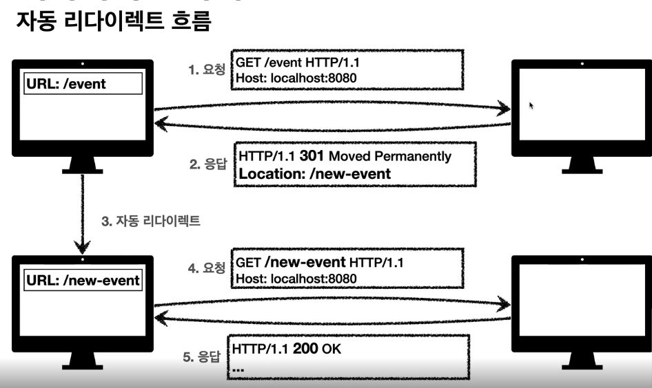
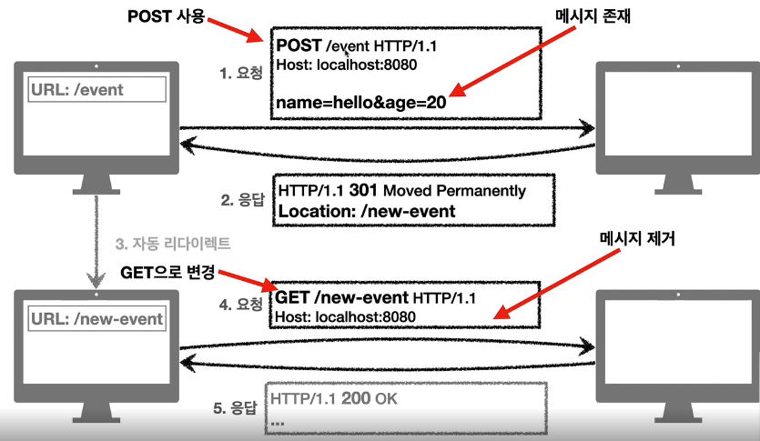
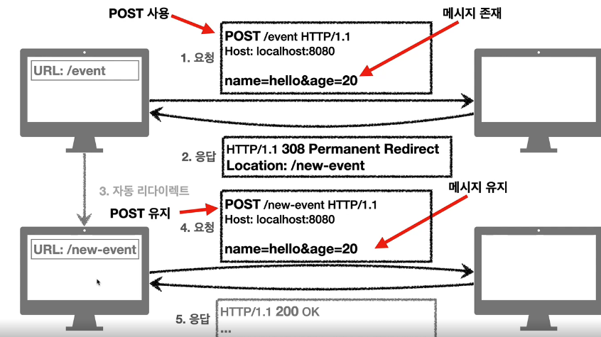
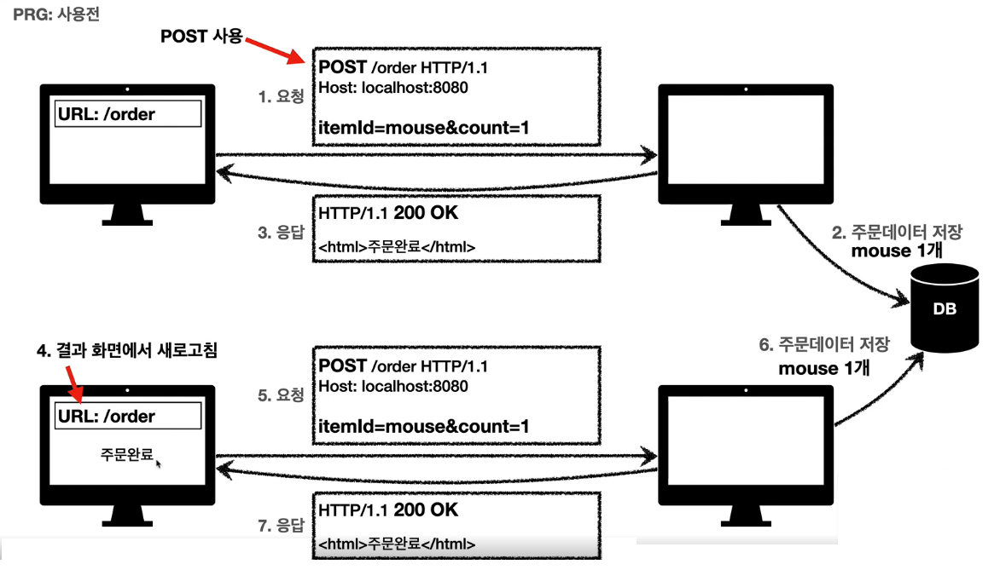
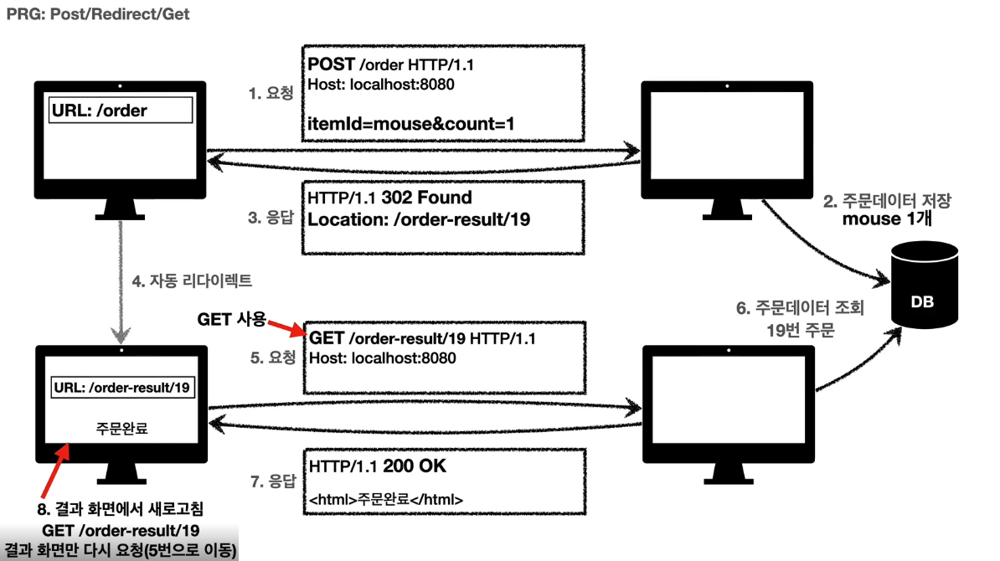
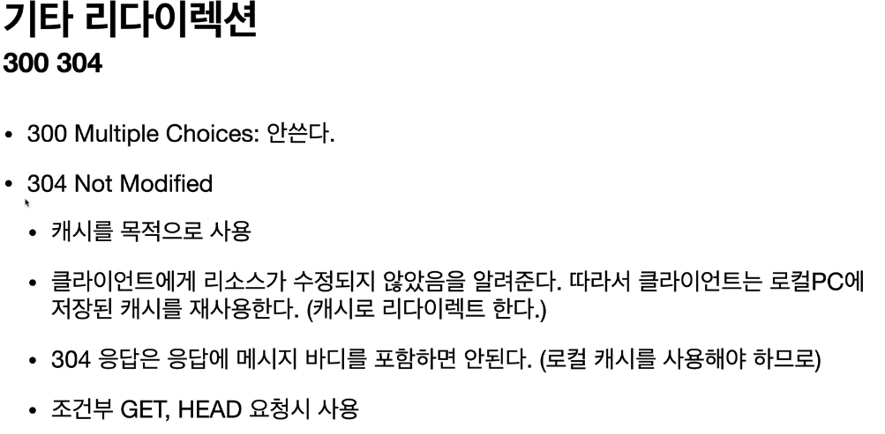

# HTTP 상태코드

## 상태코드

> 상태코드란 클라이언트가 보낸 요청의 처리 상태를 응답에서 알려주는 기능이다.

- 1xx (Informational): 요청이 수신되어 처리중
- 2xx (Successful): 요청 정상 처리
- 3xx (Redirection): 요청을 완료하려면 추가 행동이 필요
- 4xx (Client Error): 클라이언트 오류, 잘못된 문법등으로 서버가 요청을 수행할 수 없음
- 5xx (Server Error): 서버 오류, 서버가 정상 요청을 처리하지 못함

## 2xx (Successful)

> 클라이언트의 요청을 성공적으로 처리

- **200 OK**
  요청을 성공했음을 의미한다.
- **201 Created**
  요청을 성공해서 새로운 리소스가 생성된 것을 의미한다.
- **204 No Content**
  요청을 성공했지만, 응답 페이로드 본문에 보낼 데이터가 없다는 뜻이다.
  예) 웹 문서 편집기에서 save 버튼
  save 버튼의 결과로 아무 내용이 없어도 된다.
  save 버튼을 눌러도 같은 화면을 유지해야 한다.
  (바디를 리턴하지 않아도 되는 POST 요청에 쓰일 수 있다)

이런 상태코드는 종류가 많아서 개발할 때 어디까지 사용하자고 협의를 한 후에 사용을 한다.

## 3xx (Redirection)

> 요청을 완료하기 위해 유저 에이전트(웹 브라우저)의 추가 조치 필요
> 301 ~ 308을 많이 쓴다.

### 리다이렉션?

> 웹 브라우저는 3xx 응답의 결과에 Location 헤더가 있으면 그 위치로 자동 이동을 한다.

  

### 리다이렉션 종류

  

#### 영구 리다이렉션

특정 리소스의 URI가 영구적으로 이동한 경우

- 301 Moved Permanently
  - 리다이렉트 요청 메서드가 GET으로 변하고, 본문이 제거될 가능성이 있다.
- 308 Permanent Redirect
  - 301과 같은 기능
  - 리다이렉트시 요청 메서드와 본문 유지(처음 POST를 보내면 리다이렉트도 POST다)

  

#### 301 예시

  

#### 308 예시

> 실무에서는 308보다 301을 사용한다. 301을 사용하는 경우 리다이렉션을 하면서 본문이 다 날아가기 때문에 사용자 입장에서 당황스러울 수 있지만, 리다이렉션을 해야 하는 경우는 대부분 post 요청의 값들도 바뀌어야 하는 경우가 대부분이기 때문에 301이 더 자연스럽다.

  

#### 일시 리다이렉션

일시적으로 변경하는 경우
예: 주문 완료 후 주문 내역 화면으로 이동
PRG -> Post/Redirect/Get

- 302 Found
  - 리다이렉트시 요청 메서드가 GET으로 바뀔 수 있고 본문이 제거될 수 있다.
- 307 Temporary Redirect
  - 302와 기능은 같다.
  - 리다이렉트시 요청 메서드와 본문 유지(요청 메서드를 변경하면 안된다)
- 303 See Other
  - 302와 기능은 같다.
  - 리다이렉트시 요청 메서드가 GET으로 변경된다 (항상).

#### PRG?

예를 들어 주문 화면 (POST 요청)을 새로고침하면 주문이 중복으로 들어가게 되어버리는 상황을 가정하자. 주문이 중복으로 들어가면 안되시 때문에 POST로 주문을 하게 되면 주문 결과 화면을 GET 메서드로 리다이렉트를 하는 방법을 적용해볼 수 있다.
그러면 새로고침을 해도 POST가 아닌 GET 요청이 새로고침이 되어 재요청될 것이다.

**정리**

302의 첫 의도는 HTTP 메서드를 유지하는 것이었다.
하지만 웹 브라우저들이 메서드를 변경을 하기 시작했다.
그래서 모호한 302 대신 명확한 307, 303이 등장했다. 하지만 이미 많은 앱 라이브러리들이 302를 기본값으로 사용하기 때문에 자동 리다이렉션에서 GET으로 변해도 되면 302를 사용해도 큰 문제가 없다.

  

> 304의 경우 요청을 했는데 캐시에 있는 것을 그대로 쓰라고 캐시로 리다이렉트를 하는 것을 의미한다.

  

## 4xx

클라이언트 오류

> 오류의 원인이 클라이언트에 있다.
> 4xx과 5xx의 차이:
> 4xx는 같은 아무리 요청을 해도 결과가 바뀌지 않는다.
> 5xx는 같은 요청이라도 나중에 될 수가 있다.

- 400 Bad Request
  - 클라이언트가 잘못된 요청을 해서 서버가 요청을 처리할 수 없음
  - 요청 구문, 메시지 등등 오류
  - 클라이언트는 요청 내용을 다시 검토하고 보내야 한다.
- 401 Unauthorized
  - 인증이 되지 않았다는 뜻(로그인 x)
  - 401 오류 발생시 응답에 WWW-Authenticate 헤더와 함께 인증 방법을 설명
  - tip
    - 인증(Authentication): 본인이 누구인지 확인 (로그인)
    - 인가(Authorization): 권한부여 (특정 리소스에 접근할 수 있는 권한)
- 403 Forbidden

  - 서버가 요청을 이해했지만 승인을 거부함
  - 예: 어드민 등급이 아닌 사용자가 로그인을 해서 어드민 등급의 리소스에 접근하는 경우

- 404 Not Found

  - 요청 리소스가 서버에 없음
  - 클라이언트가 권한이 부족한 리소스에 접근을 했는데 해당 리소스의 존재 자체를 숨기고 싶을 때

    

## 5xx

서버 오류

- 500 Internal Server Error
  - 서버 내부 문제로 오류가 발생하는 경우
  - 구체적이지 않은 상태 코드
- 503 Service Unavailable
  - 서비스 이용 불가
  - 서버가 일시적인 과부하 또는 예정된 작업으로 잠시 요청을 처리할 수 없음을 의미
  - Retry-After 헤더 필드로 얼마 뒤에 복구되는지 보낼 수도 있다.
- 진짜 서버에 문제가 터진 게 아닌 이상 5xx 에러를 내지 않게 하는 것이 중요하다.
