# Http 헤더

  

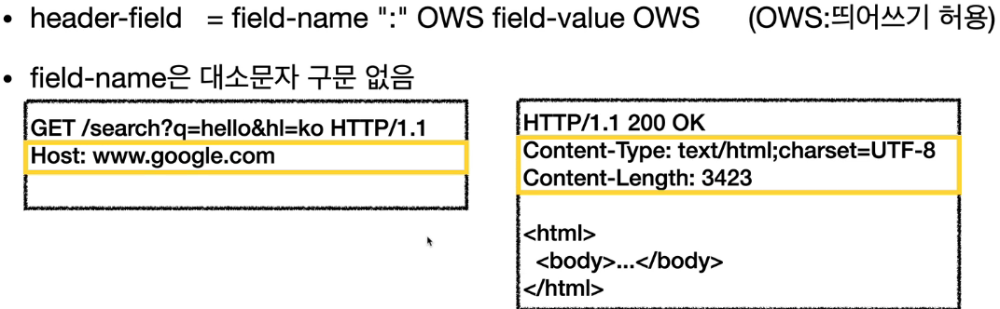

헤더는 이렇게 바디값 전에 들어가게 된다.

헤더는 HTTP 전송에 필요한 모든 부가 정보를 담고 있다.

> 예: 메시지 바디의 내용, 메시지 바디의 크기, 압축, 인증, 요청 클라이언트, 서버 정보, 캐시 관리 정보 등등

표준 헤더가 다수 존재하고 필요에 따라 임의의 헤더를 추가할 수도 있다.

HTTP 표준인 RFC2616이 폐기되고 2014년 RFC7230 ~ 7235가 등장한다.

엔티티라는 개념이 사라지고 표현이라는 개념이 생긴다.
Representation = representation metadata + representation data
표현 = 표현 메타데이터 + 표현 데이터

메시지 본문을 통해 표현 데이터를 전달한다.
메시지 본문은 페이로드라고도 부른다.
표현은 요청이나 응답에서 전달하는 실제 데이터를 의미한다.
표현 헤더는 표현 데이터를 해석할 수 있는 정보를 제공한다.

###왜 표현이라고 부르나?

예를 들어 회원 조회 내역을 제공을 해준다 가정하면, 이 내역은 회원이라는 리소스를 HTML로 표현해주는 것이다(혹은 JSON). 따라서 표현이라고 부른다.

Content-Type: 표현 데이터의 형식

- 미디어 타입, 문자 인코딩
- 예: text/html

Content-Encoding: 표현 데이터의 압축 방식

- 데이터를 전달하는 곳에서 압축 후 인코딩 헤더 추가
- 데이터를 읽는 쪽에서 인코딩 헤더의 정보로 압축 해제
- 예: gzip, deflate, identity(똑같다는 뜻)

Content-Language: 표현 데이터의 자연 언어

- 예: ko, en, en-US

Content-Length: 표현 데이터의 길이

- 바이트 단위
- Transfer-Encoding을 사용하면 Content-Length를 사용하면 안된다(이미 값이 존재).

표현 헤더는 전송, 응답 둘 다 사용한다.

## 협상(Contents Negotiation)

클라이언트가 자신이 선호하는 표현을 요청하는 것을 말한다.

Accept: 클라이언트가 선호하는 미디어 타입 전달
Accept-Charset: 클라이언트가 선호하는 문자 인코딩
Accept-Encoding: 클라이언트가 선호하는 압축 인코딩
Accept-Language: 클라이언트가 선호하는 자연 언어

협상 헤더는 요청시에만 사용한다.

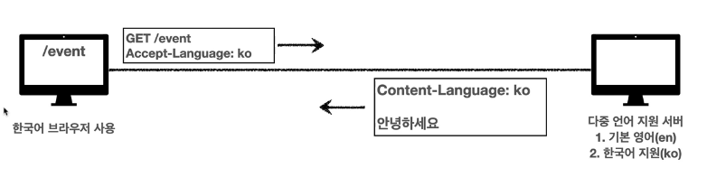

이렇게 웹브라우저가 선호하는 언어로 서버에서 응답을 해준다.

만약 원하는 언어를 지원하지 않는다면?

> 우선순위를 정할 수 있다.

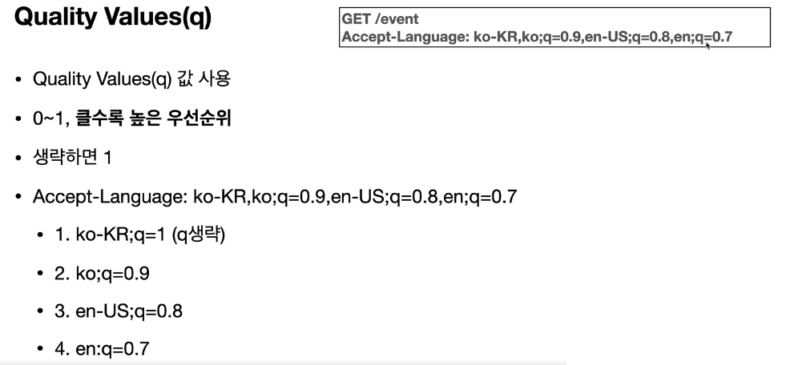

위와 같은 형태로 우선순위에 대한 점수를 부여할 수 있다. 점수가 생략되어 있다면 1이다.

#### Accept 우선 순위

> 구체적인 것이 우선이다.

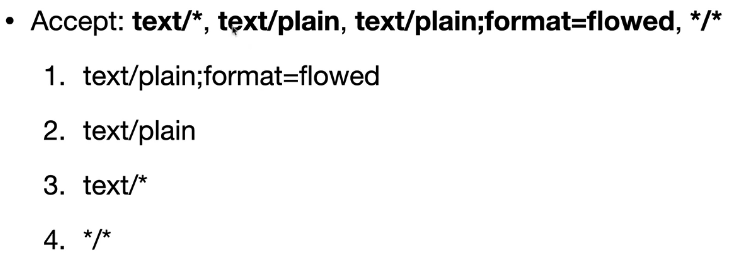

## 전송 방식

- 단순 전송
  - Content-Length를 한 번에 요청하고 한 번에 다 받는다.
- 압축 전송
  - Content-Encoding: 압축을 한 번하고 보낸다. (용량이 반 이상 줄어든다.)
- 분할 전송
  - Transfer-Encoding: chunked 쪼개서 보낸다.
  - 분할 전송을 할 때는 Content-Length를 보내면 안된다.
- 범위 전송
  - 중간에 끊길 것을 우려해서 범위를 지정해서 데이터를 요청한다.
  - Rnage: bytes=1001-2000

## 정보성 헤더

#### From

유저 에이전트의 이메일 정보

#### Referer

이전 웹 페이지 주소

- 현재 페이지 이전의 주소
- 유입 경로를 분석할 때 많이 사용한다.
- 참고: referer는 referrer의 오타이다.

#### User-Agent

클라이언트의 애플리케이션 정보(웹 브라우저 정보)

- 특정 브라우저에서 장애가 발생하는지 서버에서 확인할 수 있다.
- 요청에서 사용한다.

#### Server

요청을 처리하는 ORIGIN 서버의 소프트웨어 정보

- 오리진 서버란 마지막 서버를 말한다.

#### Date

메시지가 발생한 날짜와 시간

- 응답에서만 사용된다.

### Host

요청한 호스트 정보(도메인)

- 요청에서 사용한다.
- 필수 헤더다.
- 하나의 서버가 여러 도메인을 처리해야 할 때
- 하나의 IP 주소에 여러 도메인이 적용되어 있을 때 어떤 도메인에서 요청을 하는지 서버는 모른다.

### Location

페이지 리다이렉션

- 웹 브라우저는 3xx 응답의 결과에 Location 헤더가 있으면, 해당 Location으로 리다이렉트한다.
- 만약 201 Location이면 그 Location은 새로 생성된 것을 말한다.

### Allow

허용 가능한 HTTP 메서드

- 405 응답에 포함한다.
- 해당 URL은 어떤 요청만 쓸 수 있는지 표시한다.
- Allow: GET, HEAD, PUT

### Retry-After

유저 에이전트가 다음 요청을 하기까지 기다려야 하는 시간

- 503 (Service Unavailable): 서비스가 언제까지 불능인지 알려줄 수 있다.
- Retry-After: Fri, 31 Dec 1999 23:59:59 GMT (날짜 표기)
- Retry-After: 120 (초단위 표기)

## 인증 헤더

#### Authorization

클라이언트 인증 정보를 서버에 전달한다.

- Authorization: Basic xxxx
- 헤더는 어떤 인증인지에 따라 세부 내용은 다르다.

### WWW-Authenticate

리소스 접근시 필요한 인증 방법 정의

- 401 Unauthorized 응답과 함께 사용
- 어떻게 인증하라고 방법을 알려준다.

## 쿠키 (중요)

#### Set-Cookie

서버에서 클라이언트로 쿠키 전달(응답)

#### Cookie

클라이언트가 서버에서 받은 쿠키를 저장하고, HTTP 요청시 서버로 전달

> HTTP는 기본적으로 무상태 프로토콜이다.  
> 로그인을 해도 클라이언트와 서버가 요청과 응답을 주고 받으면 연결이 끊어지기 때문에 클라이언트가 다시 요청하면 서버는 이전 요청을 기억하지 못한다.  
> 클라이언트와 서버는 서로 상태를 유지하지 않는다.

> 대안?
> 모든 요청과 링크에 사용자 정보를 포함해서 보내볼 수 있다.
> 문제점: 보안 문제, 개발 문제등 여러 문제가 발생한다.

> 브라우저를 닫고 다시 열면?
> 요즘에는 웹 스토리지가 있어서 정보를 보존할 수 있다.

  

#### 쿠키를 사용하는 경우

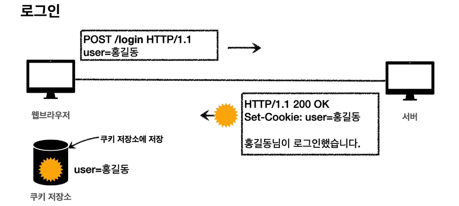
Set-Cookie를 주면 쿠키 저장소에 정보를 저장한다.

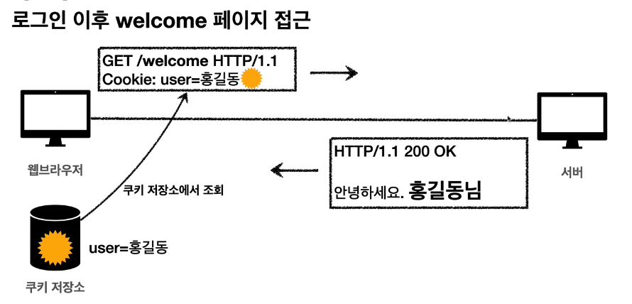
Set-Cookie를 했다면 다음 페이지 접근 요청시 쿠키 저장소에서 쿠키를 빼온다.

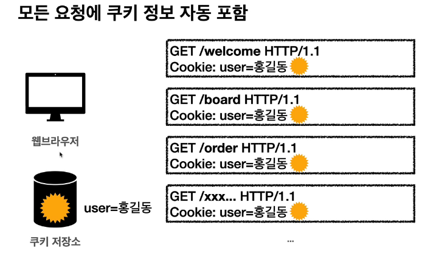
모든 경로에 자동으로 쿠키 정보가 포함된다.

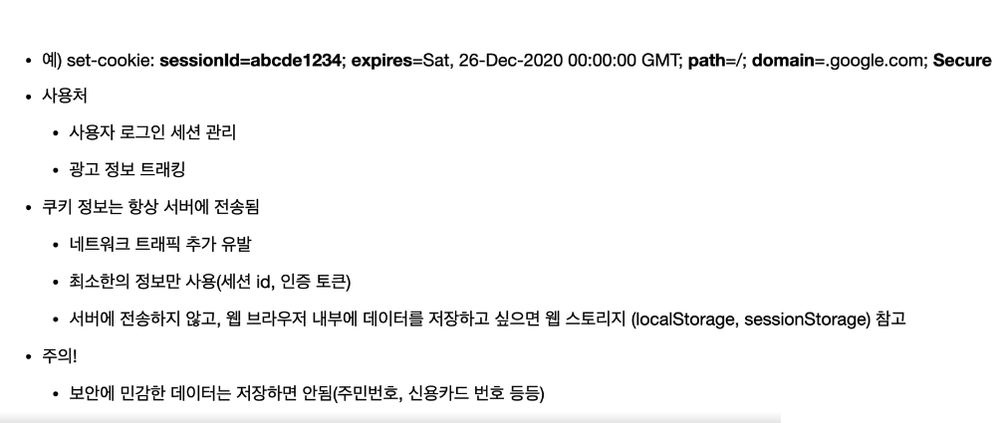
쿠키는 보안상의 이유로 sessionId라는 값으로 아이디 같은 정보가 대체된다.
만료 날짜, 경로, 도메인 등이 존재한다.

쿠키는 로그인 세션 관리나 광고 정보 트래킹에 사용된다.

쿠키 정보는 항상 서버에 전송되기 때문에 트래픽을 유발할 수 있다.

세션 쿠키: 만료 날짜를 생략하는 경우 브라우저 종료시까지만 유지
영속 쿠키: 만료 날짜를 입력하면 해당 날짜까지 유지

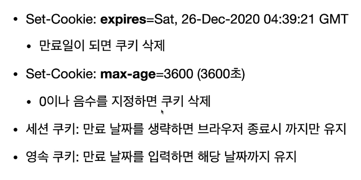

만료일을 설정할 수 있다.

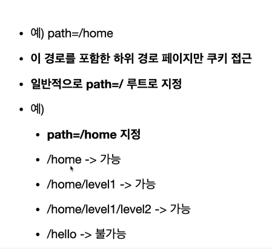

경로를 설정해주면 해당 경로와 그 경로를 포함한 하위 경로 페이지에서만 쿠키에 접근할 수 있다.

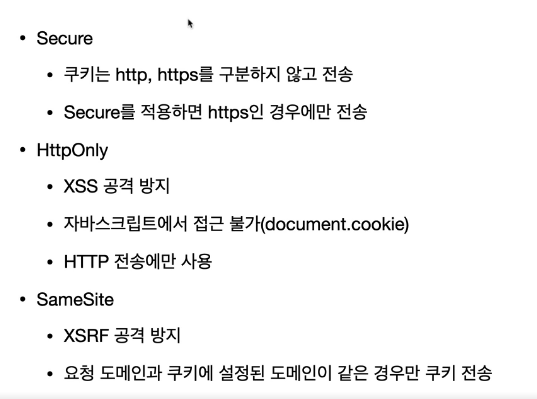
보안 여부를 고려해서 쿠키를 설정할 수 있다.

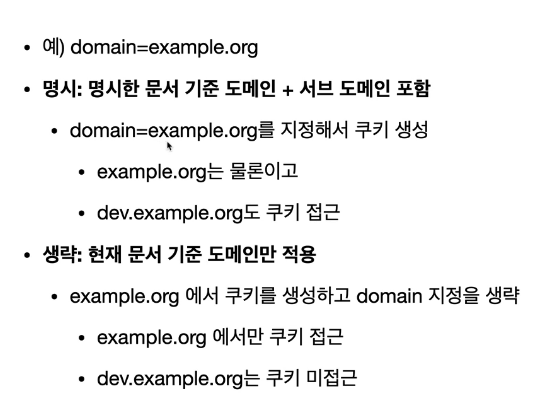

특정 도메인 기준에만 적용된다.

## 캐시

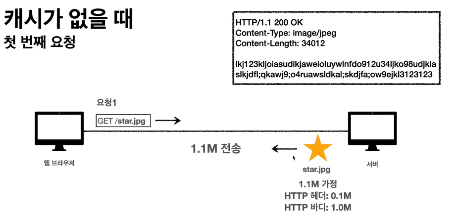

캐시가 없는 경우 몇 번을 요청하든 HTTP 헤더와 바디 총 1.1mb를 전송한다.

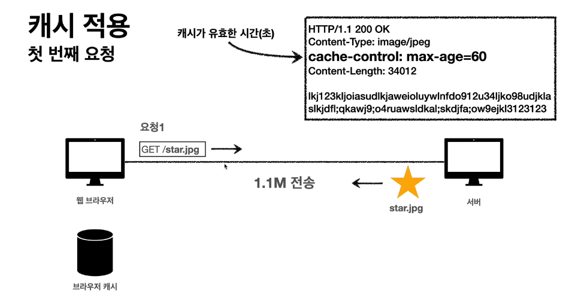

캐시가 있는 경우에는 첫 요청에만 1.1mb를 전송한다.

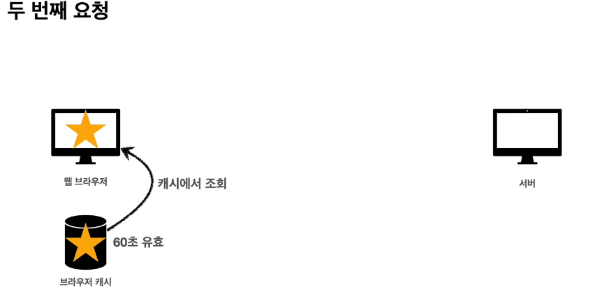

두 번째 전송부터는 캐시 안의 데이터가 만료되지 않았다면 캐시 저장소에서 바로 꺼내온다.
데이터를 만료시키는 이유는 저장된 데이터가 너무 오래 남아 있으면 업데이트가 안될 수 있기 때문이다.  
그런데 만약 만료시킨 후에도 원본의 데이터가 업데이트 되지 않았기 때문에 다음 요청에서 결국 같은 데이터를 다시 받아와서 캐시에 저장하는 경우 손해일 것이다.

### 검증 헤더와 조건부 요청

캐시가 만료되었어도 다시 사용하려면 캐시에 있는 데이터랑 서버에 있는 데이터랑 일치하는 것을 알아야지 그대로 캐시에 있는 데이터를 통해 자원을 아낄 수 있다. 이렇게 하려면 검증 헤더를 추가해야 한다.

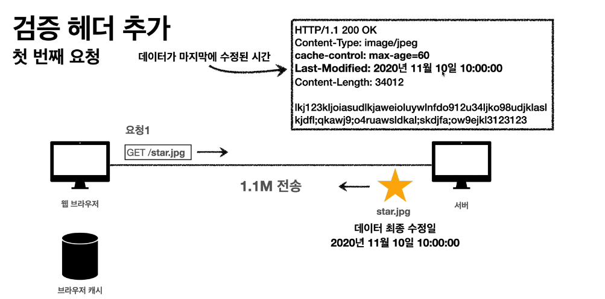

#### Last-Modified

마지막 수정된 날짜를 헤더로 추가하면 캐시가 갖고 있는 날짜와 서버의 날짜를 비교해보면 된다. 일치한다면(일치하지 않지만 허용되는 범위라면) 같은 데이터라는 뜻이니까 그대로 사용하면 된다.

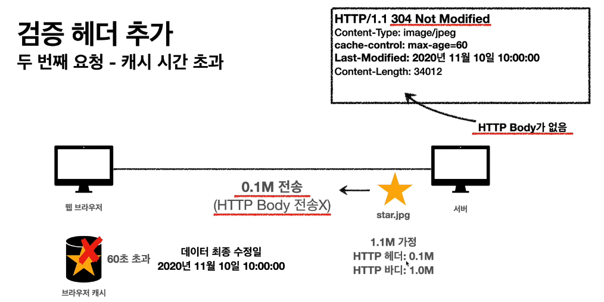

응답은 이렇게 오게 된다. 당연히 데이터는 변경 사항이 없으니 바디값을 따로 포함하지 않는다. 응답을 통해 cache-control로 캐시 유효 시간을 업데이트 한다.
응답의 http method는 304 Not Modified다.

### 검증 헤더와 조건부 요청 (cont.)

If-Modified-Since: Last-Modified 사용한다.
If-None-Match: Etag 사용한다.
조건 만족하면 200 OK
조건이 만족하지 않으면 304 Not Modified

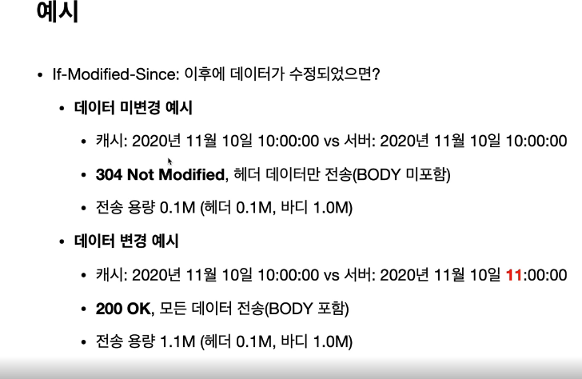

예를 들어 If-Modified-Since 조건부 요청을 했는데
데이터가 변경되지 않았으면 304 Not Modified를 보낸다.

데이터가 변경되었다면 modified가 true기 때문에 200 OK를 보내게 된다.

캐시 조정은 1초 미만 단위로 조정할 수 없다.
날짜 기반의 로직을 사용한다. 여기서 발생할 수 있는 문제는 바로 서버 정보가 업데이트 되었기 때문에 날짜 역시 갱신 되었지만 실질적인 데이터의 형태는 이전과 차이가 없을 때다. 이런 경우 데이터가 바뀐 것으로 인식해 다시 서버에서 데이터를 불러올 것이다.

#### ETag (Entity Tag)

캐시용 데이터에 임의의 고유한 버전 이름을 달 수가 있다.
캐시 데이터에 버전을 부여해서 (예: 해시 테이블) 캐시 데이터 버전이 같으면 유지하게 만든다.

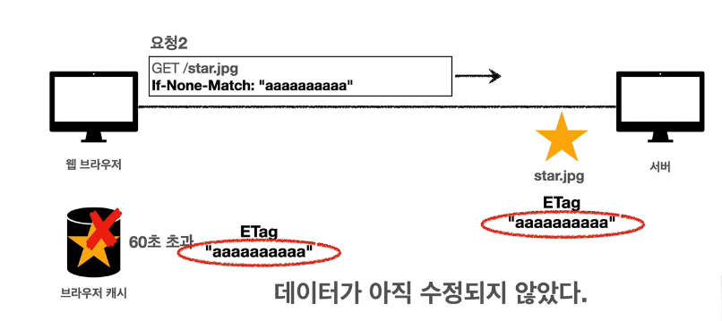

If-None-Match: "ㅁㅁㅁ" 는 ㅁㅁㅁ과 일치하는 게 없냐고 물어보는 것과 같다.
위 그림에서는 일치하는 게 있기 때문에 데이터가 수정되지 않았다는 뜻이고 아래처럼
304를 리턴한다.

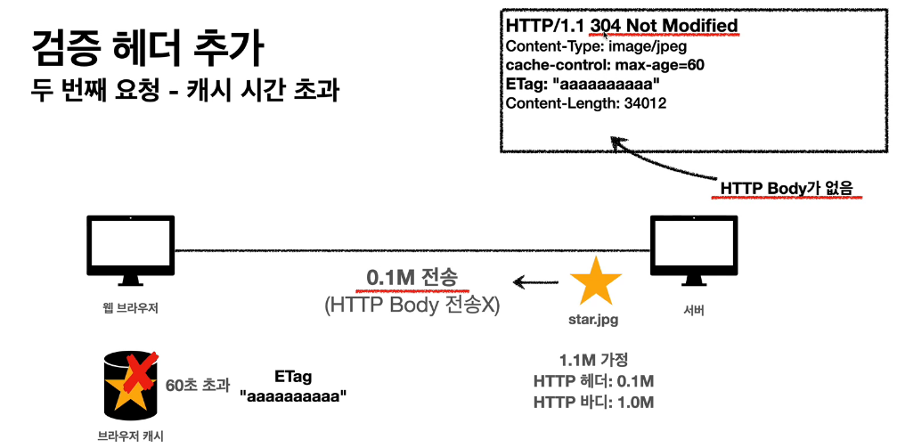

#### 캐시와 조건부 요청 헤더

##### 캐시 제어 헤더

- Cache-Control: 캐시 지시어
  - max-age: 캐시 유효 시간, 초 단위
  - no-cache: 데이터는 캐시해도 되지만, 항상 원 서버에 검증하고 사용한다.
  - no-store: 데이터에 민감한 정보가 있으므로 저장하면 안됨
- Pragma: 캐시 제어(하위 호환)
  - no-cache: HTTP 1.0 에서 사용
- Expires: 캐시 유효 기간 (하위 호환)
  - 캐시 만료일을 정확한 날짜로 지정한다.
  - Cache-Control: max-age와 함께 사용하면 Expires는 무시된다.

정리:

검증 헤더 (Validator)

- ETag: "~~"
- Last-Modified: ~~

조건부 요청 헤더

- If-Match, If-None-Match: ETag 값 사용
- If-Modified-Since, If-Unmodified-Since: Last-Modified 값 사용

### 프록시 캐시 서버?

원 서버에서 데이터를 직접 받기에는 너무 오래 걸리는 경우가 있다.
그럴 때는 프록시 캐시 서버를 이용한다.

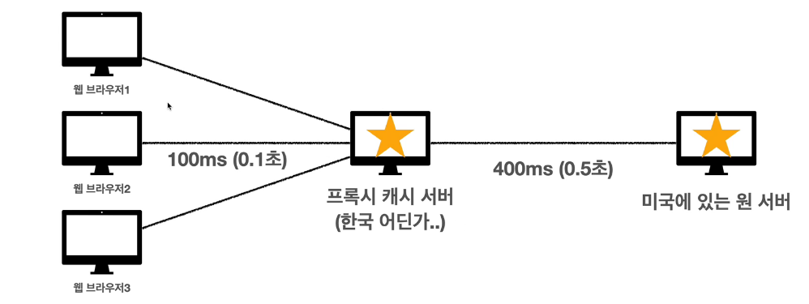

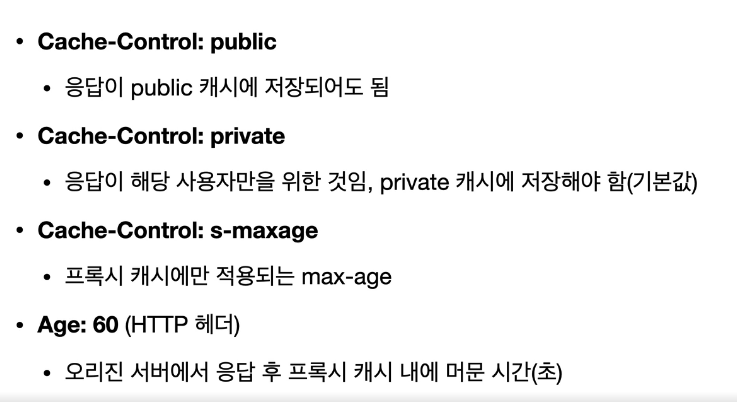

### 캐시 무효화

의도하지 않아도 웹브라우저에서 캐시를 해버리는 경우가 있다 (GET 요청 같은 것).

이를 방지하기 위해 캐시를 하지 않는다는 확실한 헤더를 추가할 수 있다.

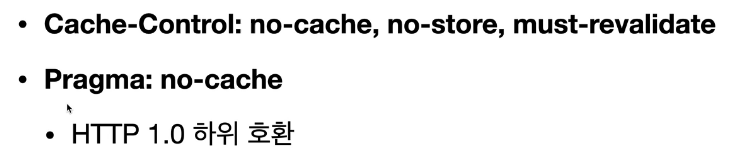

위와 같은 헤더를 추가해야 한다. (전부)

각각은 이런 의미가 있다.

- Cache-Contorl: no-cache
  - 데이터는 캐시해도 되지만, 항상 원 서버에 검증하고 사용해라
- Cache-Control: no-store
  - 데이터에 민감한 정보가 있으므로 저장하면 안된다는 뜻
- Cache-Control: must-revalidate
  - 캐시 만료 후 최초 조회시 원 서버에 검증해야 한다
  - 원 서버 접근 실패시 반드시 오류가 발생해야 한다 - 504(Gatewway Timeout)
  - must-revalidate는 캐시 유효 시간이라면 캐시를 사용함.
- Pragma: no-cache
  - HTTP 1.0 하위 호환

  

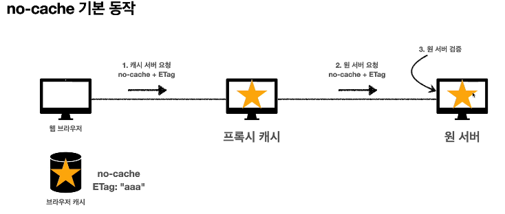
no-cache는 기본적으로 이렇게 동작한다. 캐시 서버가 요청을 받으면 원 서버로 넘겨 준다.

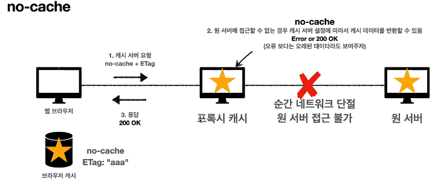
만약 no-cache만 사용하게 된다면 특이사항이 발생할 수 있다. 어떤 이유로 원 서버와 프록시 캐시 서버와 단절이 된 상황이다. 이 상황에서 캐시 서버에서는 오류를 보내는 것보다 과거 데이터를 뿌려주는 게 더 합리적이라 생각하고 캐시를 사용할 수가 있다.
따라서 아래와 같은 처리도 추가해주어야 한다.

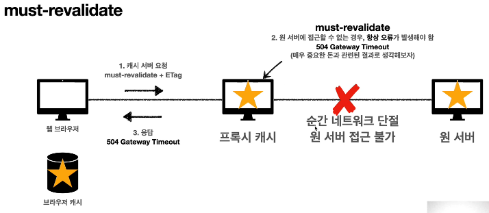
must-revalidate는 원 서버에 접근할 수 없는 경우 에러를 리턴하게끔 한다. 따라서 특정 이유로 원 서버와 프록시 서버가 단절되어 캐시 서버의 데이터가 넘어가는 것을 방지할 수 있다.
