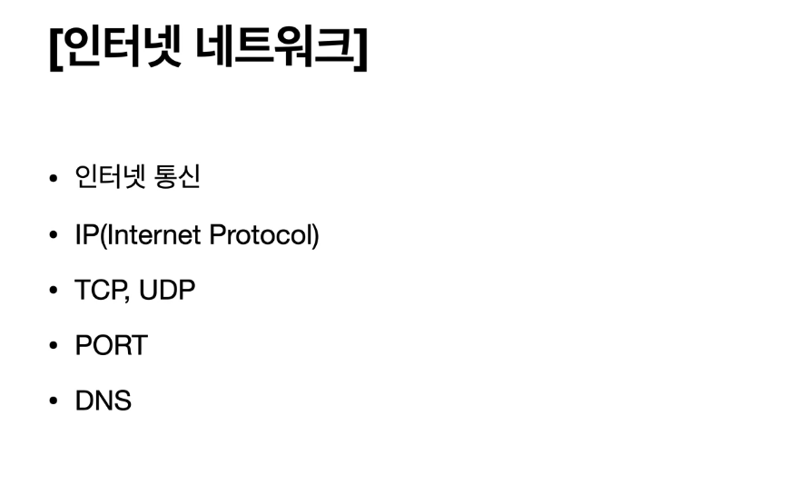

### 인터넷 통신

> 인터넷에서 통신은 어떻게 이루어질까?

 

> 데이터는 중간에 수많은 서버를 거쳐서 전송이 된다. 이 원리를 알려면 IP (Internet Protocol) 에 대해 이해를 해야 한다!

 

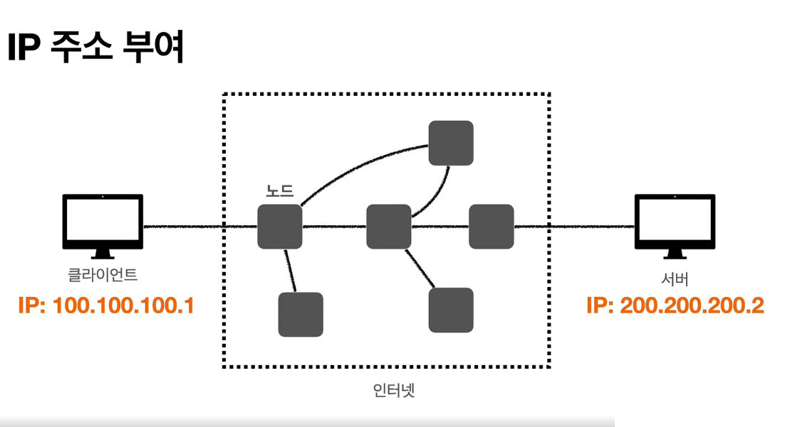

> IP 주소라는 것을 통해 전달을 하는 곳과 전달을 받아야 하는 장소가 명확해진다.

 

> 하지만 이렇게 주소를 부여해서 전송을 하는 것에는 여러 문제점이 있다.

 

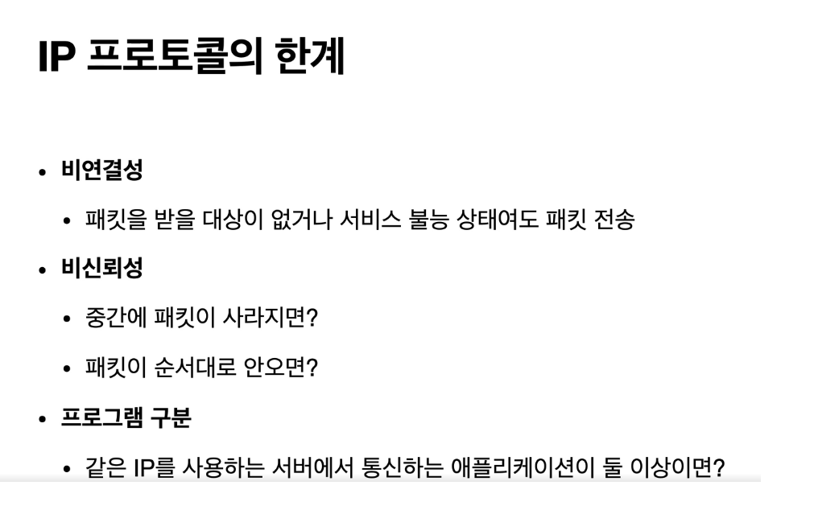

> 1. 비연결성
>    데이터, 혹은 패킷을 받아야 하는 대상이 없어도 전송을 한다.
>    이는 사람이 더 이상 살지 않는 목적지에 우편을 보내는 것과 같다.
>     
> 2. 비신뢰성
>    중간에 패킷이 사라지면 대처할 수가 없다.
>    중간에서 패킷을 전송하는 서버가 종료되면 그대로 소실된다.
>     
>    패킷이 순서대로 오지 않는 경우에 대한 대처 방안이 없다.
>    데이터의 용량이 크면 (보통 1500바이트 이상) 여러 패킷(패키지와 버킷의 합성어)으로 나뉘어서 보내진다. 하나의 온전한 데이터를 위해서는 각 패킷이 도착하는 순서가 중요한데 이를 보장해주는 방법이 없다.
>     
> 3. 프로그램 구분
>    같은 IP를 사용하는 서버에 통신하는 애플리케이션이 여러 개면 도달 위치를 파악하기 어렵다.
>     

위의 문제점을 해결해주는 것이 TCP/UDP 이다!

  

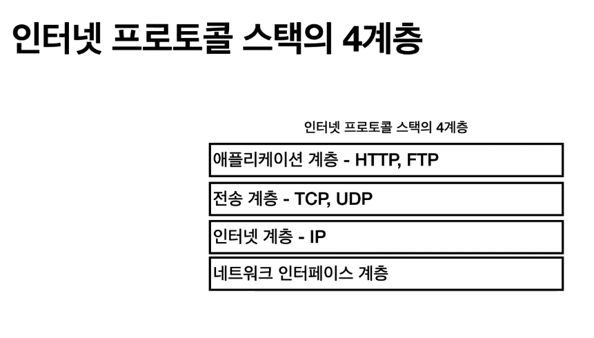

> 인터넷 프로토콜 스택의 4계층은 위와 같다.

  

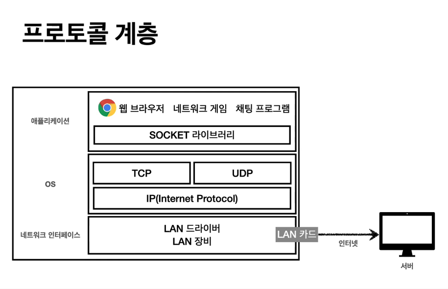
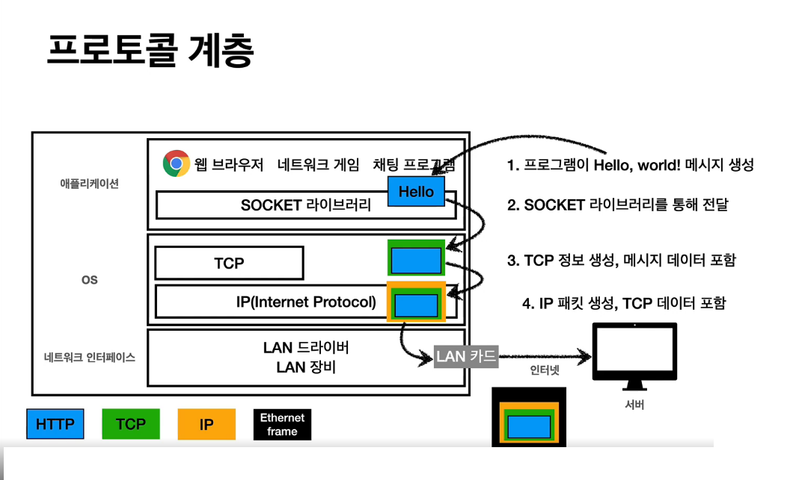

> 어떤 정보를 보낼 때 애플리케이션에서는 보통 SOCKET 라이브러리를 사용한다. 그리고 이는 TCP로 가서 메시지 데이터에 TCP 정보를 생성한다. 그리고 IP로 전달되고 이곳에서 IP패킷이 생성된다. 마지막으로 LAN카드를 통해 Ethernet Frame이라는 것이 씌워져 전송이 시작된다.

 

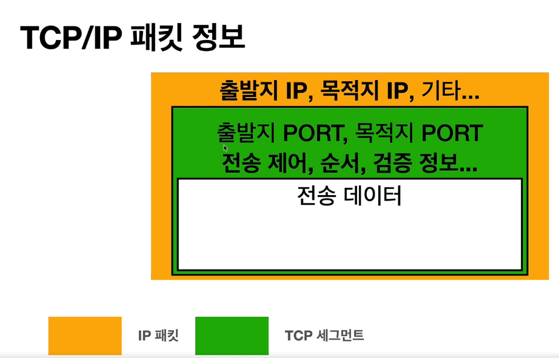

> TCP/IP 패킷에는 위에서 언급된 출발지, 목적지 주소 외에도 PORT, 전송 제어, 순서, 검증 정보 등이 있다.

  

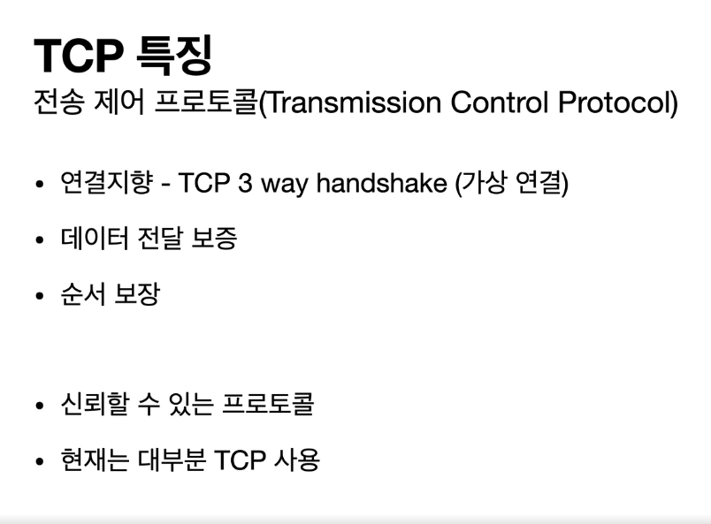

> TCP 에서는 출발지와 목적지의 연결을 확인하며 (연결지향)
> 데이터가 중간에 유실되었는지 확인을 하기 때문에 데이터 전달이 보증된다. 그리고 순서 역시 보장된다. 따라서 신뢰할 수 있는 프로토콜이고 현재는 대부분 TCP를 사용하고 있다.

  

### 연결을 어떻게 확인할까?

> 3 way handshake를 통해 연결을 확인한다.
> 먼저 클라이언트가 서버로 접속 요청을 보낸다 (SYN).
> 서버가 요청을 수락하는 신호와 접속 요청을 다시 보낸다 (SYN + ACK).
> 클라이언트도 요청 수락을 보낸다 (ACK).

> 이렇게 총 3번의 신호를 주고 받음으로써 서로 신뢰할 수 있음을 확인하고 데이터 전송을 할 수 있게 된다.

  

### 데이터 전달 보증?

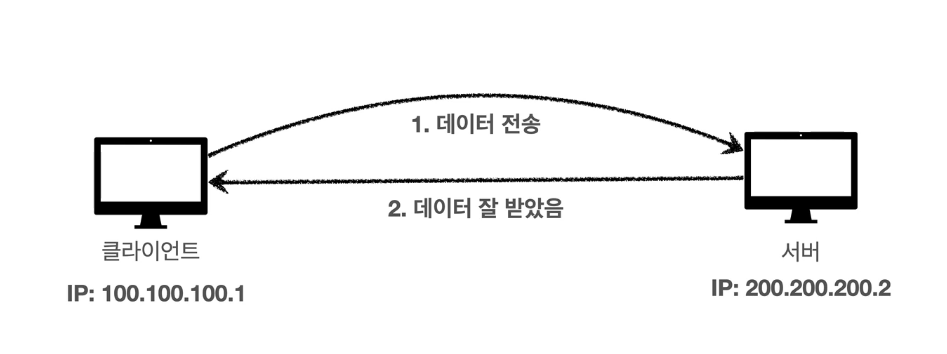

> 데이터를 다 받았다면 다 받았다는 신호를 보내주기 때문에 데이터의 전달을 보증한다.

  

### 순서 보장?

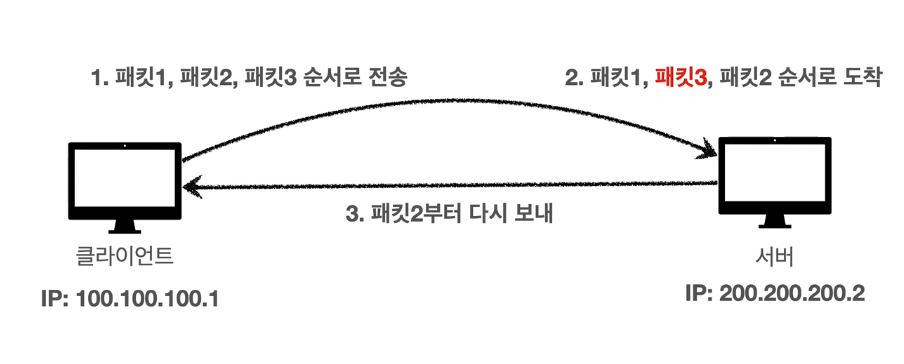

> 패킷의 순서가 바뀌면 바뀐 시점에서 부터 다시 패킷을 요청한다. (물론 최적화할 수도 있다.)

  

### UDP는??

> UDP는 TCP와 같은 계층에 있다. 백지라고 봐도 된다. 아무 역할이 없다. TCP처럼 연결, 데이터 전달, 순서를 보장하지 않는다. IP와 거의 같지만 PORT와 데이터에 대한 검증만 추가되었다. 여기서 PORT란 동일 IP의 여러 애플리케이션 중 특정 애플리케이션을 알 수 있는 기능이다.

> UDP의 장점은 절차가 복잡하지 않기 때문에 단순하고 빠르다는 것이다. TCP는 이미 손을 볼 수 없지만 내가 네트워크를 최적화하고 싶으면 UDP를 갖고 애플리케이션에 추가 작업을 해서 기능을 얹을 수 있다.

> 요즘 거의 다 TCP를 쓰지만 최근에는 UDP가 다시 뜨는 추세다.

  

### PORT

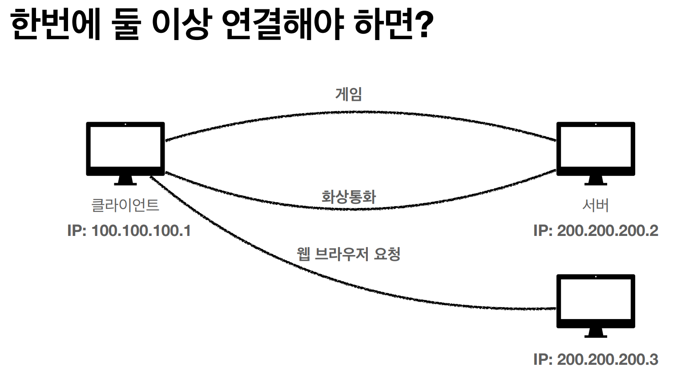

> 같은 IP에서 사용되는 여러 프로세스를 구분하기 위해 PORT의 개념을 사용한다.

 

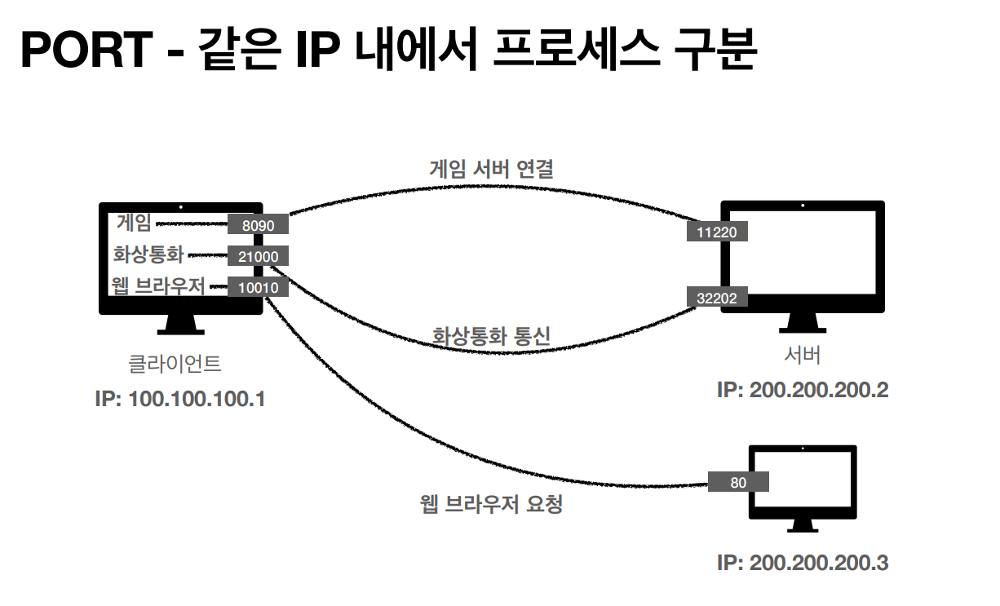

> 이렇게 애플리케이션마다 포트를 지정해서 사용한다.

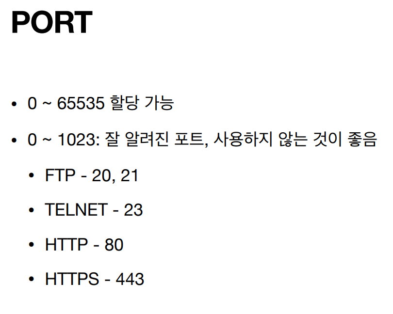

> 포트 번호 중 일부는 이렇게 사용된다.

  

### DNS?

> IP는 계속 변하고 기억하기 어렵다.
> 일종의 전화전호부 같은 DNS(Domain Name System)를 사용한다.

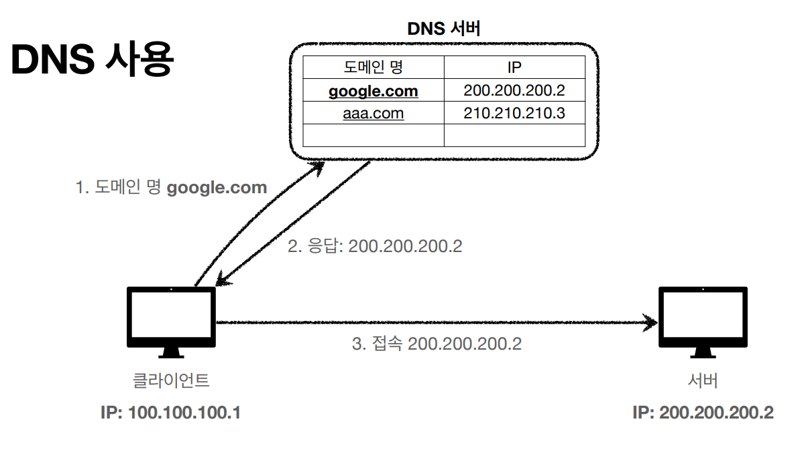

> 이렇게 도메인 명을 받으면 DNS 서버에 도메인 명을 전달하고 일치하는 IP를 전달받아서 사용한다.
